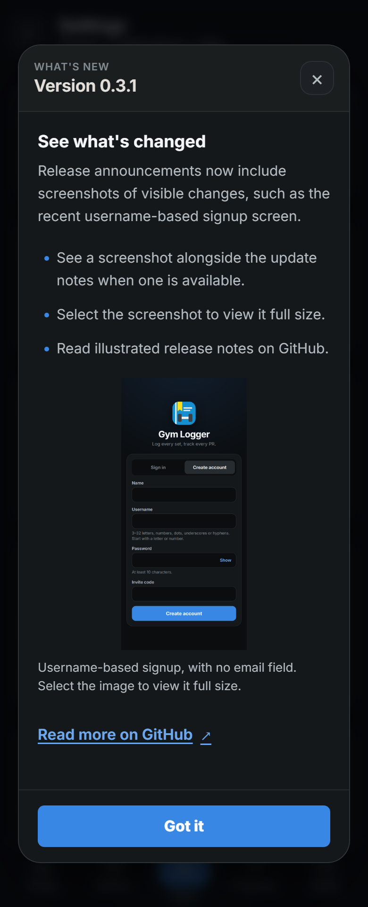
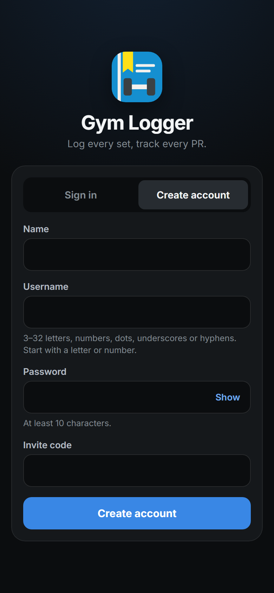

# Gym Logger release notes

## 0.3.1

- The **What's new** pop-up can show a screenshot alongside the release notes. Select it to view the image full size.
- Screenshots include descriptive text and scale to fit mobile screens. If an image cannot load, the notes, GitHub link and dismissal controls remain available.
- Release screenshots are stored with the GitHub notes; the announcement uses a direct image URL pinned to the screenshot's commit. Releases without a screenshot continue to work.

The illustrated announcement in the isolated mobile verification environment, using the [username signup screenshot](screenshots/releases/0.3.0-username-signup.png) as an example.

## 0.3.0

- Create accounts and sign in with a **username and password**. Account emails are no longer collected or stored in the active users table.
- Usernames ignore letter case and use 3–32 ASCII letters, numbers, dots, underscores or hyphens, starting with a letter or number. The separate display name remains available.
- Profile, the admin console, account backup metadata and administrative commands now identify accounts by username. CLI commands use `--username` instead of `--email`.
- Existing accounts keep their IDs, passwords, sessions, preferences and workout history. Migration `0030_username_accounts` assigns usernames from the part of the old email before `@`, sanitizes unsupported characters and adds numeric suffixes for collisions. Short or unusable names become `user`. Administrators can run `python -m app.manage list-users` to see assignments.
- Invite codes, registration controls and push notifications continue to work. The server's Web Push contact mailbox is separate from accounts and stays configured.
- New account backup manifests use format 2 with an owner username. Existing backup archives are preserved. Because old account emails are removed, rollback requires the pre-update database backup and previous application version.

Username-based account creation in v0.3.0, captured with empty fields in the isolated verification environment.

## 0.2.0

- A **What's new** pop-up shows the deployed version, a short list of changes and a link to these GitHub notes when you sign in, reopen the app or reconnect after an update.
- Dismiss a version once per account and browser. Later releases appear automatically; local and production addresses remember dismissal independently. First-time users see the current release too.
- Open **Settings → What's new → View changes** to read the announcement again, including during local development.
- Announcements wait while the workout or video upload screen is open, and while the app is loading or showing a completion/message dialog.

## Publishing the next announcement

1. Edit `frontend/release.json`. Choose the version manually following [the agent release policy](../AGENTS.md#release-versions-and-announcements). Default to a patch bump (`0.3.0` to `0.3.1`) for fixes, UI changes and small improvements to existing features. Use a minor bump (`0.3.0` to `0.4.0`) only for a clear, substantial new capability or workflow, and explain that choice in the PR. Prefer a patch when unclear. Several PRs can share one pending release: update its notes without another bump. Versions track releases, not PR or merge counts; compare with the latest deployed version and never reuse a deployed number. A release containing a substantial new capability plus patches uses the minor bump once. Update `title`, `summary`, `changes` and `url`. `url` must be an HTTPS GitHub link to your release, changelog or pull request. The build validates the metadata but does not increment versions automatically.
2. Add the detailed notes here (keep previous versions), or publish a GitHub release and link to it instead. If this repository is private, readers need GitHub access to open that link; the short notes remain visible inside the app.
   For a visible feature or UI improvement, include a screenshot of the verified revision using isolated sample data. Inspect it for private information, commit it under `docs/screenshots/releases/` with a versioned filename, and embed it here using a relative image path, descriptive alt text and a caption. Before/after images are useful when they clarify the change. Explain omitted screenshots in the notes or pull request when capture is unavailable or the change has no visible result.
   The optional `image` object in `frontend/release.json` uses `url` and `alt` to display the same screenshot in the app's pop-up. Use a direct HTTPS `raw.githubusercontent.com` image URL pinned to the screenshot's commit, not a GitHub page URL or temporary browser-artifact path. Check anonymous access before publishing; private-repository images may not be accessible to app users. If the image is unavailable, the app still shows the text and dismissal controls.
3. Test the feature and announcement locally. Dismissal is remembered for each version; **View changes** always reopens the dialog without clearing browser data.
4. Commit and push the code and metadata, merge to the VM's deployment branch, then run the existing VM update procedure. It pulls, builds the frontend and restarts the backend. A bare `git pull` does not rebuild `frontend/dist`.

Vite emits `release.json` into `frontend/dist` with the app and serves it directly during development. The browser checks that deployed file using `cache: no-store`; the service worker does not precache it. The announcement therefore follows the build being served, including when building on a PC and copying the complete `dist` to the VM. Changing source notes without deploying a new frontend build leaves the production announcement unchanged.

If users miss several releases, they see the latest summary and can follow the link for earlier notes. Network failures leave the app usable and are retried when it returns to the foreground or reconnects. Dismissal survives sign-out; deleting browser storage shows the notes again. Browsers that block storage remember dismissal for the current page session only.
